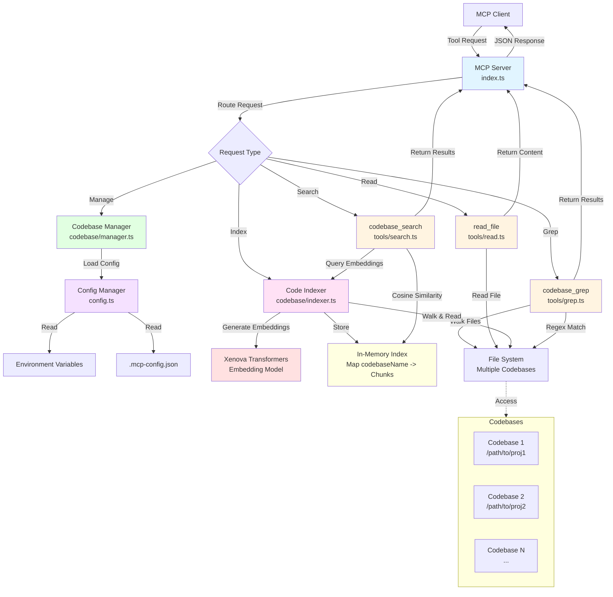

# Simple RAG Code MCP Server

An MCP (Model Context Protocol) server that provides tools for searching and reading code across multiple codebases. Supports both semantic search (using embeddings) and text/regex search.

## Features

- **Semantic Search**: Search code by meaning using embeddings
- **Text/Regex Search**: Traditional grep-like search with regex support
- **Multi-codebase Support**: Search and read from multiple codebases simultaneously
- **File Reading**: Read files with optional line range support
- **Codebase Management**: Add, list, and manage multiple codebases

## Installation

```bash
# Install dependencies
npm install
# or
yarn install

# Build the project
npm run build
# or
yarn build
```

## Configuration

### Environment Variables

You can configure codebases using environment variables:

```bash
export MCP_CODEBASES='[{"name":"my-project","path":"/path/to/project"}]'
```

### Config File

Alternatively, create a `.mcp-config.json` file in the project root:

```json
{
  "codebases": [
    {
      "name": "my-project",
      "path": "/path/to/project"
    }
  ],
  "embeddingModel": "Xenova/all-MiniLM-L6-v2",
  "chunkSize": 1000,
  "chunkOverlap": 200
}
```

## Usage

### Running the Server

```bash
npm run dev
# or
yarn dev
```

### MCP Client Configuration

Add this to your MCP client configuration:

```json
{
  "mcpServers": {
    "simple-rag-code-mcp": {
      "command": "node",
      "args": ["dist/index.js"]
    }
  }
}
```

Or for development:

```json
{
  "mcpServers": {
    "simple-rag-code-mcp": {
      "command": "tsx",
      "args": ["src/index.ts"]
    }
  }
}
```

## Available Tools

### `codebase_search`

Semantic search across codebases using embeddings.

**Parameters:**
- `query` (required): The search query in natural language
- `codebaseNames` (optional): Array of codebase names to search. If not provided, searches all indexed codebases.
- `limit` (optional): Maximum number of results (default: 10)

**Example:**
```json
{
  "query": "function that handles user authentication",
  "codebaseNames": ["my-project"],
  "limit": 5
}
```

### `codebase_grep`

Text/regex search across codebases.

**Parameters:**
- `pattern` (required): The search pattern (regex supported)
- `codebaseNames` (optional): Array of codebase names to search
- `caseSensitive` (optional): Whether search is case sensitive (default: false)
- `contextLines` (optional): Number of context lines around matches (default: 2)
- `maxResults` (optional): Maximum number of results (default: 100)

**Example:**
```json
{
  "pattern": "function\\s+\\w+Auth",
  "codebaseNames": ["my-project"],
  "caseSensitive": false
}
```

### `read_file`

Read a file from a codebase.

**Parameters:**
- `codebaseName` (required): Name of the codebase
- `filePath` (required): Relative path to the file
- `startLine` (optional): Start line number (1-indexed)
- `endLine` (optional): End line number (1-indexed)

**Example:**
```json
{
  "codebaseName": "my-project",
  "filePath": "src/utils/auth.ts",
  "startLine": 10,
  "endLine": 50
}
```

### `list_codebases`

List all configured codebases.

**Parameters:** None

### `add_codebase`

Add a new codebase to the server.

**Parameters:**
- `name` (required): Unique name for the codebase
- `path` (required): Absolute path to the codebase directory

**Example:**
```json
{
  "name": "another-project",
  "path": "/path/to/another/project"
}
```

### `index_codebase`

Index a codebase for semantic search. This may take some time for large codebases.

**Parameters:**
- `codebaseName` (required): Name of the codebase to index

**Example:**
```json
{
  "codebaseName": "my-project"
}
```

### `get_indexed_codebases`

Get list of codebases that have been indexed for semantic search.

**Parameters:** None

## Architecture Overview



## How It Works

1. **Codebase Management**: Codebases are configured via environment variables, config file, or runtime API
2. **Indexing**: For semantic search, codebases need to be indexed first. The indexer:
   - Walks through code files in the codebase
   - Chunks code into smaller pieces
   - Generates embeddings using a transformer model
   - Stores embeddings in memory
3. **Semantic Search**: Uses cosine similarity between query embeddings and code chunk embeddings
4. **Text Search**: Uses regex matching across all code files

## Supported File Types

The server automatically recognizes and processes common code file extensions:
- TypeScript/JavaScript: `.ts`, `.tsx`, `.js`, `.jsx`
- Python: `.py`
- Java: `.java`
- C/C++: `.c`, `.cpp`, `.h`, `.hpp`
- And many more (see code for full list)

## Ignored Files/Directories

The following are automatically ignored:
- `node_modules`
- `.git`
- `dist`, `build`
- `.cache`, `coverage`
- Lock files (`package-lock.json`, `yarn.lock`, etc.)

## Limitations

- File reading is limited to 10MB per file
- Semantic search requires indexing first (can be slow for large codebases)
- Embeddings are stored in memory (not persisted across restarts)
- Large codebases may take significant time to index

## Development

```bash
# Development mode with hot reload
npm run dev

# Build for production
npm run build

# Run production build
npm start
```

## License

MIT
