# Simple RAG Code MCP Server

An MCP (Model Context Protocol) server that provides tools for searching and reading code across multiple codebases. Supports both semantic search (using embeddings) and text/regex search.

## Overall Flow

```mermaid
flowchart LR
    A["🤖 AI Agent<br/>Tool Request"] -->|JSON-RPC| B["🔧 MCP Server<br/>Process Request"]
    B -->|Execute| C["🛠️ Tools<br/>Search/Grep/Read"]
    C -->|Results| D["📤 Response<br/>Return to Agent"]
    
    style A stroke:#333,stroke-width:2px
    style B stroke:#333,stroke-width:2px
    style C stroke:#333,stroke-width:2px
    style D stroke:#333,stroke-width:2px
```



## Agent Tool Call Flow


## Features

- **Semantic Search**: Search code by meaning using embeddings
- **Text/Regex Search**: Traditional grep-like search with regex support
- **File Finder**: Find files by name/path pattern (like Command+P in VSCode)
- **Multi-codebase Support**: Search and read from multiple codebases simultaneously
- **File Reading**: Read files with optional line range support
- **Codebase Management**: Add, list, and manage multiple codebases

## Installation

```bash
# Install dependencies
npm install
# or
yarn install

# Build the project
npm run build
# or
yarn build
```

## Configuration

### Environment Variables

You can configure codebases using environment variables:

```bash
export MCP_CODEBASES='[{"name":"my-project","path":"/path/to/project"}]'
```

### Config File

Alternatively, create a `.mcp-config.json` file in the project root:

```json
{
  "codebases": [
    {
      "name": "my-project",
      "path": "/path/to/project"
    }
  ],
  "embeddingModel": "Xenova/all-MiniLM-L6-v2",
  "chunkSize": 1000,
  "chunkOverlap": 200
}
```

## Usage

### Running the Server

```bash
npm run dev
# or
yarn dev
```

### MCP Client Configuration

Add this to your MCP client configuration:

```json
{
  "mcpServers": {
    "simple-rag-code-mcp": {
      "command": "node",
      "args": ["dist/index.js"]
    }
  }
}
```

Or for development:

```json
{
  "mcpServers": {
    "simple-rag-code-mcp": {
      "command": "tsx",
      "args": ["src/index.ts"]
    }
  }
}
```

## Available Tools

| Tool Name | Description | Required Parameters | Optional Parameters |
|-----------|-------------|---------------------|---------------------|
| `codebase_search` | Semantic search across codebases using embeddings | `query` - The search query in natural language | `codebaseNames` - Array of codebase names to search (default: all indexed codebases)<br>`limit` - Maximum number of results (default: 10) |
| `codebase_grep` | Text/regex search across codebases | `pattern` - The search pattern (regex supported) | `codebaseNames` - Array of codebase names to search<br>`caseSensitive` - Whether search is case sensitive (default: false)<br>`contextLines` - Number of context lines around matches (default: 2)<br>`maxResults` - Maximum number of results (default: 100) |
| `read_file` | Read a file from a codebase | `codebaseName` - Name of the codebase<br>`filePath` - Relative path to the file | `startLine` - Start line number (1-indexed)<br>`endLine` - End line number (1-indexed) |
| `find_file` | Find files by name/path pattern across codebases (similar to Command+P in VSCode) | `pattern` - The file name or path pattern to search for (supports wildcard `*`) | `codebaseNames` - Array of codebase names to search (default: all codebases)<br>`maxResults` - Maximum number of results (default: 50) |
| `list_codebases` | List all configured codebases | None | None |
| `add_codebase` | Add a new codebase to the server | `name` - Unique name for the codebase<br>`path` - Absolute path to the codebase directory | None |
| `index_codebase` | Index a codebase for semantic search (may take time for large codebases) | `codebaseName` - Name of the codebase to index | `maxFiles` - Maximum number of files to index in this batch (default: unlimited)<br>`batchSize` - Number of files to process in parallel (default: 50)<br>`skipLargeFiles` - Skip files larger than 10MB (default: true) |
| `get_indexed_codebases` | Get list of codebases that have been indexed for semantic search | None | None |

### Examples

#### `codebase_search`
```json
{
  "query": "function that handles user authentication",
  "codebaseNames": ["my-project"],
  "limit": 5
}
```

#### `codebase_grep`
```json
{
  "pattern": "function\\s+\\w+Auth",
  "codebaseNames": ["my-project"],
  "caseSensitive": false
}
```

#### `read_file`
```json
{
  "codebaseName": "my-project",
  "filePath": "src/utils/auth.ts",
  "startLine": 10,
  "endLine": 50
}
```

#### `find_file`
```json
{
  "pattern": "auth.ts",
  "codebaseNames": ["my-project"],
  "maxResults": 20
}
```

**Pattern Examples for `find_file`:**
- `"auth.ts"` - Find files named `auth.ts`
- `"utils/*.ts"` - Find all `.ts` files in `utils` directories
- `"*component*"` - Find files containing "component" in name or path
- `"src/utils"` - Find files with "src/utils" in path

#### `add_codebase`
```json
{
  "name": "another-project",
  "path": "/path/to/another/project"
}
```

#### `index_codebase`
```json
{
  "codebaseName": "my-project",
  "maxFiles": 1000,
  "batchSize": 50,
  "skipLargeFiles": true
}
```

**Note:** For very large codebases, you can index in batches by calling `index_codebase` multiple times with increasing `maxFiles` values, or index incrementally by starting with a smaller `maxFiles` and increasing it gradually.

## Example Tool Call Sequence


## Architecture Overview


## How It Works

1. **Codebase Management**: Codebases are configured via environment variables, config file, or runtime API
2. **Indexing**: For semantic search, codebases need to be indexed first. The indexer:
   - Walks through code files in the codebase
   - Chunks code into smaller pieces
   - Generates embeddings using a transformer model
   - Stores embeddings in memory
3. **Semantic Search**: Uses cosine similarity between query embeddings and code chunk embeddings
4. **Text Search**: Uses regex matching across all code files

## Supported File Types

The server automatically recognizes and processes common code file extensions:
- TypeScript/JavaScript: `.ts`, `.tsx`, `.js`, `.jsx`
- Python: `.py`
- Java: `.java`
- C/C++: `.c`, `.cpp`, `.h`, `.hpp`
- And many more (see code for full list)

## Ignored Files/Directories

The following are automatically ignored:
- `node_modules`
- `.git`
- `dist`, `build`
- `.cache`, `coverage`
- Lock files (`package-lock.json`, `yarn.lock`, etc.)

## Limitations

- File reading is limited to 10MB per file
- Semantic search requires indexing first (can be slow for large codebases)
- Embeddings are stored in memory (not persisted across restarts)
- Large codebases may take significant time to index

## Development

```bash
# Development mode with hot reload
npm run dev

# Build for production
npm run build

# Run production build
npm start
```

## License

MIT
