# MCP Server Flow Diagram

## Agent to MCP Server Flow

### Overall Flow

```mermaid
flowchart LR
    A["🤖 AI Agent<br/>Tool Request"] -->|JSON-RPC| B["🔧 MCP Server<br/>Process Request"]
    B -->|Execute| C["🛠️ Tools<br/>Search/Grep/Read"]
    C -->|Results| D["📤 Response<br/>Return to Agent"]
    
    style A fill:#e1f5ff
    style B fill:#fff4e1
    style C fill:#ffe1f5
    style D fill:#e1ffe1
```

### Detailed Flow

## Detailed Flow: Semantic Search

## Detailed Flow: Grep Search

## Detailed Flow: Add Codebase

## Tool Request/Response Format

## Error Handling Flow

